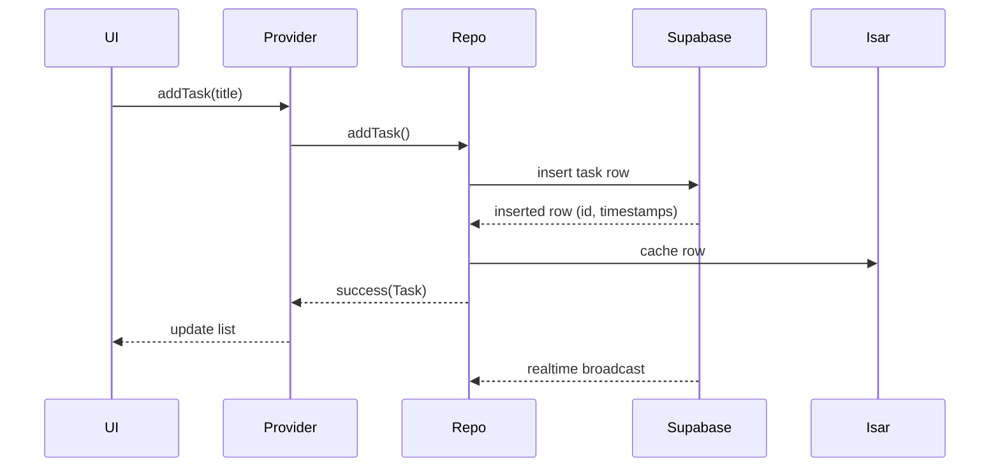
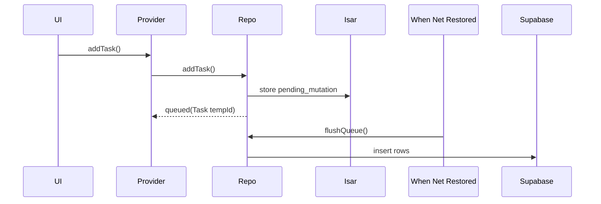

# Todo App – Design Document

_Last updated: 2025-07-19_

## 1. High-Level Architecture
```
Flutter UI  ──► Riverpod Providers ──► Repository Layer ──► Supabase Client
                               ▲                         │
                               └── Isar Local Cache ◄────┘
```
* **Flutter UI**  – Screens & widgets (Material 3).  
* **Riverpod Providers**  – State management; exposes `AsyncValue<List<Task>>`.  
* **Repository Layer**  – Abstracts persistence (local + remote).  
* **Supabase Client**  – Auth, PostgREST, Realtime, Storage, Edge.  
* **Isar**  – Offline cache & pending mutations table.

### Modules
| Package | Responsibility |
|---------|----------------|
| `core/` | models, utils, logging |
| `data/` | repositories, DTO ↔︎ model mappers |
| `features/auth/` | sign-in screens, providers |
| `features/tasks/` | list, detail, edit UI |
| `features/settings/` | theme, notification toggles |

## 2. Data Flow Sequence (Add Task – Online)


## 3. Data Flow Sequence (Add Task – Offline)


## 4. Key Implementation Considerations
* **Conflict Resolution**  – Last-write-wins based on `updated_at`. Server authoritative.
* **Connectivity**  – Use `connectivity_plus` & `stream_transform` to debounce.
* **Auth Guards**  – GoRouter redirect on auth state.
* **Testing**  – Mock Supabase via `supabase_flutter_test` or dio interceptors.
* **CI**  – Lint, unit+widget tests, mutation tests, build.

## 5. Security & Privacy
* All network calls over TLS.
* RLS policies already enforced (see schema).
* Store tokens in secure storage.

## 6. Deployment
* **Backend**  – Supabase (free tier) → monitor for row count limits.
* **Mobile**  – GitHub Actions → Flutter build → TestFlight/Play Console.
* **Web**  – `flutter build web` → Netlify.

## 7. Open Questions
1. Attachments size limits (Storage).  
2. Edge Function quota for AI features.  
3. GDPR data export UX.

---
_End of design document._
